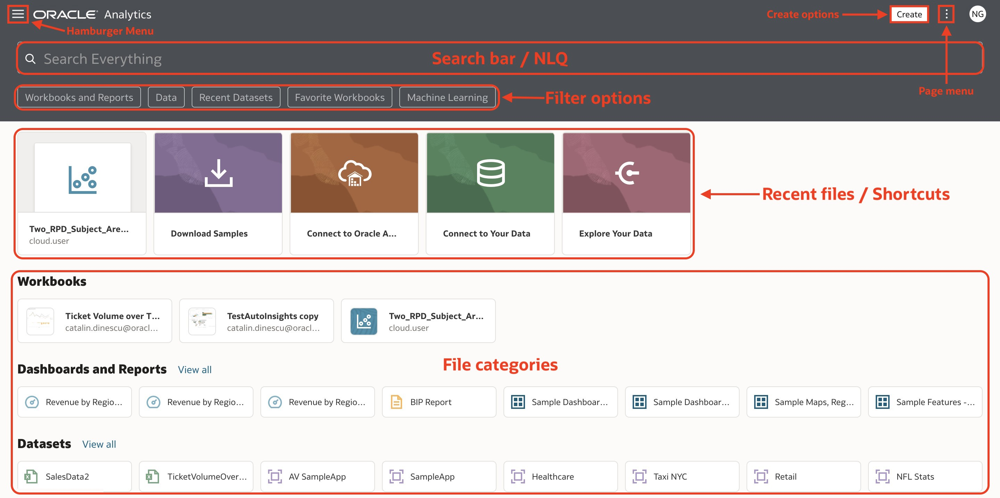
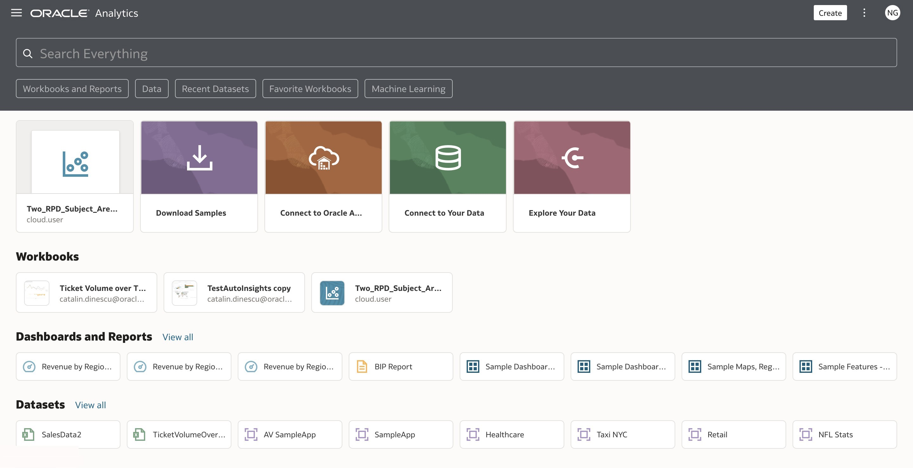
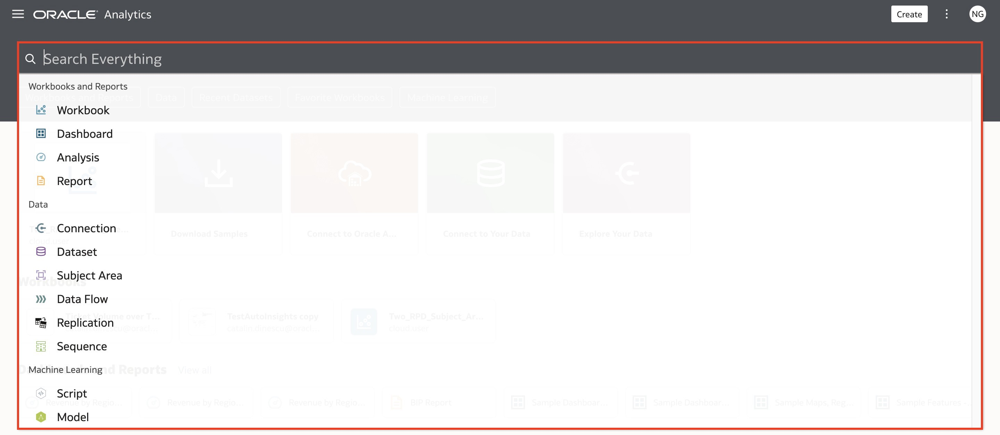
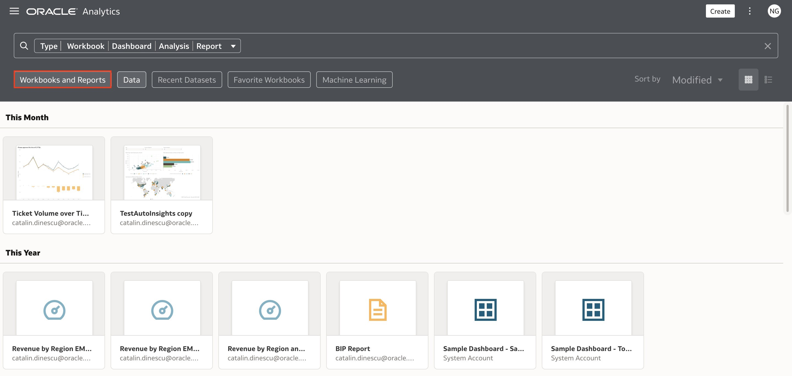
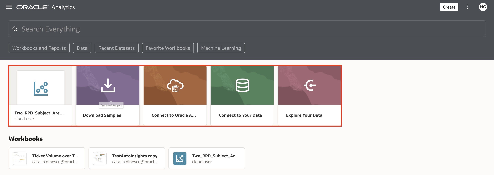
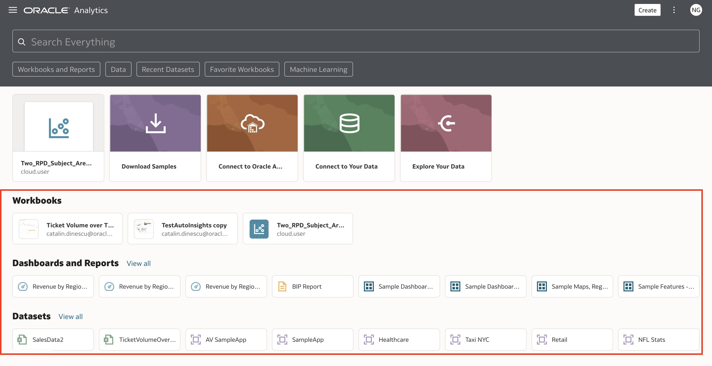
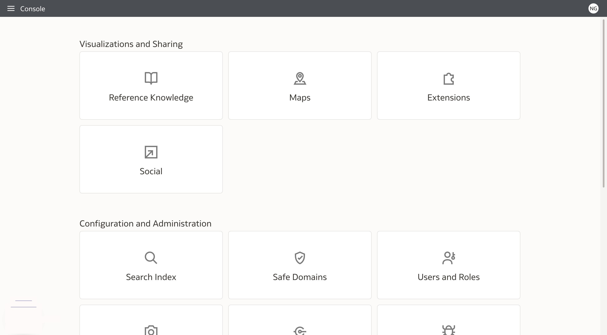

# Explore the Oracle Analytics Homepage

## Introduction

In this lab, you will get familiar with the Oracle Analytics homepage and learn where everything is located. You will learn about the homepage layout and the different actions you can take with each button. Below is an overview of the homepage, which you will explore in this lab:

  

Estimated Time: 10 minutes

### Objectives

In this lab, you will:
* Explore the homepage layout
* Explore the different create options
* Explore the sections in the Hamburger menu
* Explore the page menu options

### Prerequisites

This lab assumes you have:
* Access to Oracle Analytics Cloud

## Task 1: Explore the Oracle Analytics Homepage
In this section, you will learn about the Oracle Analytics homepage layout and learn about all the bells and whistles that exist behind each button.

1. This is the Oracle Analytics homepage.

  

2. Click the **Search bar**. The search bar has two main functions: Searching for your Oracle Analytics objects and using the BI Ask functionality, where you ask questions from your datasets. For example, you can type "Show me revenue by product per region," and clicking Shift + Enter will show you the resulting data visualization. Note: You must have the datasets with those columns for the system to generate the appropriate visualizations.

  

3. The first row of options under the search bar is your **filter options**. They are Workbooks and Reports, Data, Recent Datasets, Favorite Workbooks, and Machine Learning. Each option filters the objects on your homepage to display objects of that selected type. Click Workbooks and Reports.

  

4. The homepage will only display your workbooks and reports. If you enter a keyword in the search bar, it will only show results of that keyword filtered to Workbooks and Reports. This concept applies to the rest of the options, such as Data, Recent Datasets, Favorite Workbooks, and Machine Learning. Click the Close icon in the search bar to exit the filter.

  

5. The third set of objects shows your most **recent activities**. When you first log in to your instance, you will see four colorful tiles. Each of these tiles is a shortcut: The Download Samples tile navigates to examples of Oracle Analytics projects that you can import to your instance, Connect to Oracle Autonomous Data Warehouse opens up the connection configuration, Connect to Your Data allows you to connect to data sources, and Explore Your Data allows you to create a workbook. Click through the different options to get a feel for what they do.

  

6. Below your most recent objects, you'll notice different categories such as Workbooks, Dashboard and Reports, Datasets, etc. If you mark files as Favorites, they appear under a Favorites section.

  

7. Your homepage is completely customizable. Click the **Page Menu** and select **Customize Home Page...**.

  

8. You can rearrange the different sections as you wish. You can hide sections, choose the size of the objects, and decide how many rows of items you want for each section. Click **Save** if you made changes.

  

9. Let's explore the rest of the **Page Menu** options.
    * Import Workbook/Flow allows you to import .dva files that contain workbooks
    * Dataset Management allows you to monitor how much data each user has consumed. Each user is allocated 50GB of data.
    * Open Data Modeler (Need help understanding this)
    * Register Model/Function allows you to register Machine Learning models, OCI Functions, OCI Language models, and OCI Vision models, which you can leverage in Oracle Analytics Cloud.
    * Open Classic Home allows you to work with content for reporting, mobile, actionable intelligence, or pixel-perfect reporting
    * Customize Home Page allows you to customize the different sections within your homepage

  

10. Now, let's explore the items you can create with the **Create** button. As you read through each feature, feel free to click them and get familiar with the UI.
    * **Workbook** lets you explore your data by creating data visualizations
    * **Dataset** allows you to create datasets from your choice of data source
    * **Data Flow** allows you to curate your datasets for visualizations. You can create datasets, join data from different sources, aggregate data, train machine learning models, perform object detection, image classification, etc. using the OCI Vision service and much more.
    * **Sequence** allows you to run multiple data flows together as a single transaction
    * **Connection** allows you to create connections to your data sources
    * **Data Replication** allows you to import data from Oracle Cloud applications into data stores such as Oracle ADW, and Oracle DB to visualize them in OAC
    * **Replication Connection** allows you to set up a data replication connection
    * **Semantic Model** is a web-based data modeling tool that allows you to build semantic models

  

11. Click **Semantic Model** to explore what the Semantic Model allows you to do.

  

12. To test the semantic model options, give it a name and click **Create**.

  

13. You have four options when you create a semantic model:
    * **Start with Empty Model**: This option requires you to build the semantic model from the ground up.
    * **Import File**: If you have an existing semantic model RPD file, you can import it here.
    * **Load from Analytics Server**: If you have existing model content in OAS you want to import to create a semantic model, you can do that here.
    * **Clone a Git Repository**: If you want to create a semantic model using your Git repository, you can do so with this option.

  

## Task 2: Explore the Navigation Menu Options
In this section, you will explore the different tabs that live in the Hamburger menu.

1. Navigate back to the OAC homepage. Now, let's explore the **Hamburger menu** options. Click the Hamburger menu. Depending on your job role, you will see a list of actions you can take within your OAC instance. You can access your **Catalog, Data, Machine Learning, Semantic Models, Jobs, and the Console**.

  

2. Click **Catalog**. Catalog is where all of your workbooks are stored. My Folders will contain workbooks that are only visible to you, and if you choose to share workbooks with other users, you will need to move your workbooks to the Shared Folders section.

  

3. Click the **Hamburger menu** and select **Data**. The Data tab is where all of your items related to data live. This is where you'll find all your **Datasets, data source Connections, Data Flows, Sequences, and Data Replications.**

  

4. Click the Hamburger menu and select **Machine Learning**. Your machine learning models will be located under Models, and your ML scripts will be under Scripts.

  

5. Click the Hamburger menu and select **Semantic Models**. The semantic models you create can be found here.

  

6. Click the Hamburger menu and select **Jobs**. This is where your jobs and scheduled jobs will be listed.

  

7. Click the Hamburger menu and select **Console**. You can configure and manage your OAC service if you have the **BI Service Administrator** role. You can perform all administrative tasks for your service, such as configuring user roles, system settings, etc.

  

You may now proceed to the next lab.

## Learn More
* [Getting Started with Oracle Analytics Cloud](https://docs.oracle.com/en/cloud/paas/analytics-cloud/acsgs/what-is-oracle-analytics-cloud.html#GUID-E68C8A55-1342-43BB-93BC-CA24E353D873)

## Acknowledgements
* Author - Nagwang Gyamtso, Product Manager, Analytics Product Strategy
* Last Updated By/Date - Nagwang Gyamtso, February 2023
