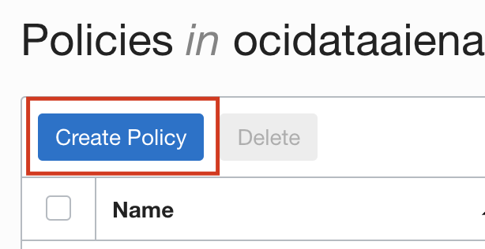
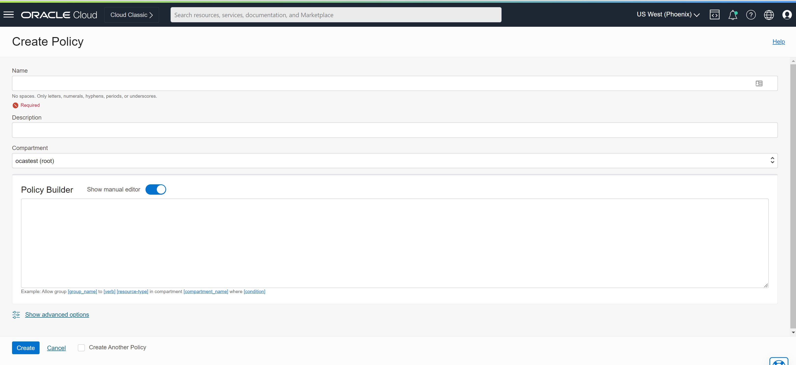
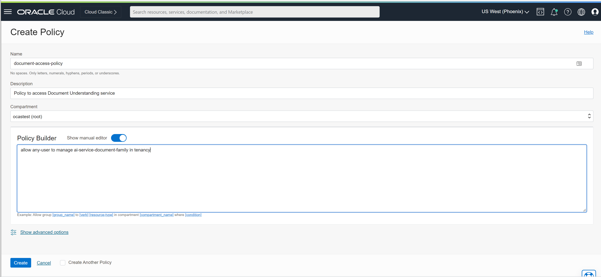

# Lab 1: Configure Document Understanding policies

## Introduction

In this lab, you will use the OCI Console to set up the policies for OCI Document Understanding.

Estimated Time: 10 minutes


### Objectives

In this workshop, you will:

* Get familiar with the OCI Console and be able to configure your policies for OCI Document Understanding

## Task 1: Policy Setup
Before you start using OCI Document Understanding, OCI policies should be setup for allowing you to access OCI Document Understanding Service. Follow these steps to configure required policies.

1. Navigate to Policies
  Log into OCI Cloud Console. Using the Burger Menu on the top left corner, navigate to Identity & Security and click it, and then select Policies item under Identity.

    

2. Create Policy

  Click Create Policy

    

3. Set compartment to your root compartment and toggle on the manual editor
        
  Configure as shown below: 

    

4. Create Policy to grant users Document APIs access (Required)

  Add the below statement to allow all the users in your tenancy to use document understanding:
    ```
    <copy>allow any-user to manage ai-service-document-family in tenancy</copy>
    ```

    

  If you want to limit access to a user group, create a policy with the below statement:
    ```
    <copy>allow group <group-name> to use ai-service-document-family in tenancy</copy>
    ```

5. Policy to access input document files in object storage (Recommended)

  If your want to analyze documents stored in your tenancy's object storage bucket, add the below statement to grant object storage access permissions to the group:
    ```
    <copy>allow group <group_in_tenancy> to use object-family in tenancy</copy>
    ```
        
  If you want to restrict access to a specific compartment, you can use the following policy instead: 
    ```
    <copy>allow group <group_in_tenancy> to use object-family in compartment <input_bucket_located_object_storage_compartment></copy>
    ```

6. Policy to access output location in object storage (Required)

  Document Understanding Service stores results in your tenancy's object store. Add the following policy to grant object storage access permissions to the user group who requested the analysis to documents:
    ```
    <copy>allow group <group_in_tenancy> to manage object-family in compartment <output_bucket_located_object_storage_compartment></copy>
    ```

Congratulations! </br>
In this lab you have learnt how to set up your OCI Document Understanding policies.

You may now **proceed to the next lab**.


## Acknowledgements
* **Authors**
    * Kate D'Orazio - Product Manager


* **Last Updated By/Date**
    * Kate D'Orazio, Feb 2023
