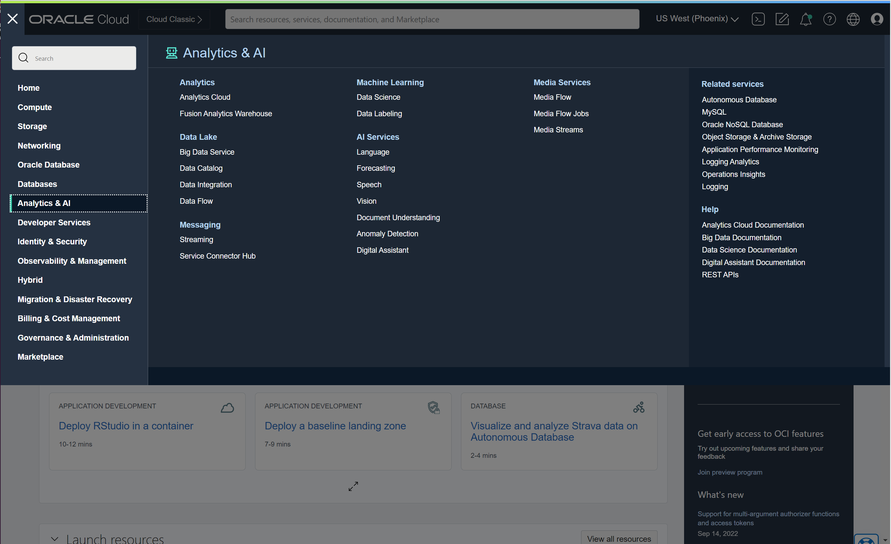
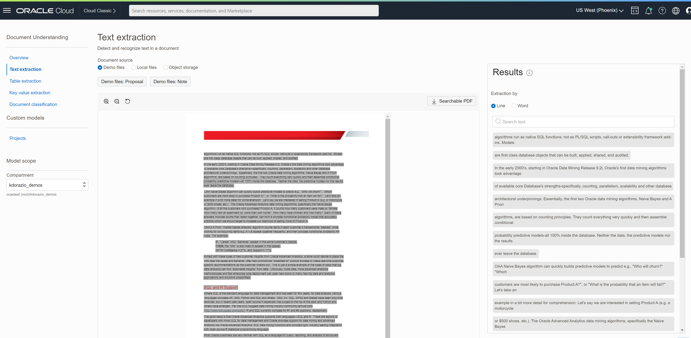
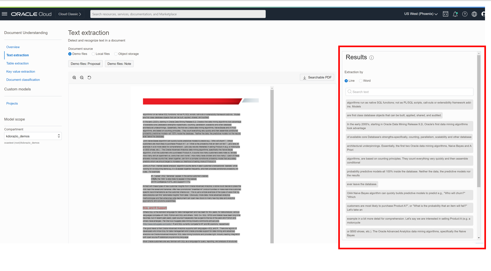
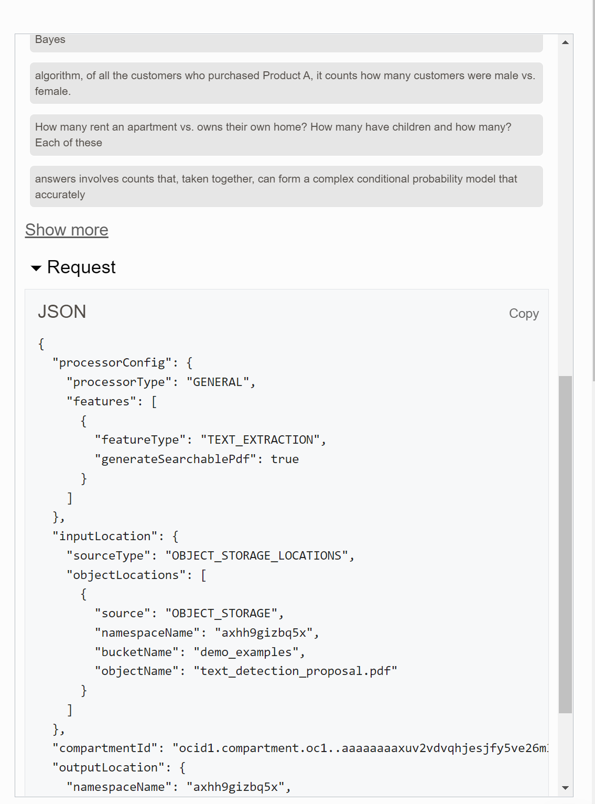
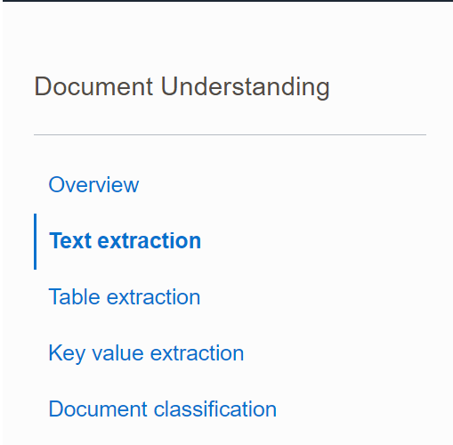
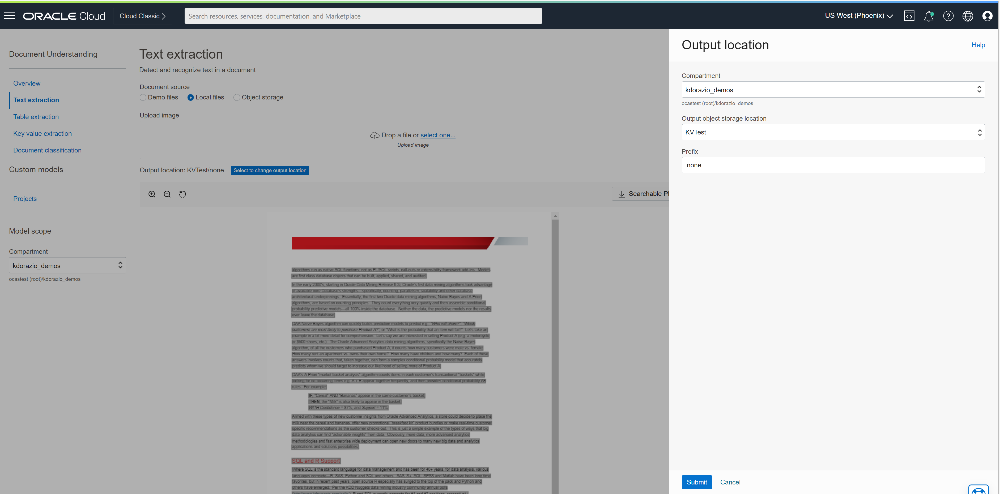

# Use OCI Document Understanding in the Console

## Introduction
In this lab, we will learn how to use OCI Document Understanding in the OCI Console in order to test various features on demo documents as well as your own documents.

*Estimated Time*: 20 minutes

## **Task 1:** Upload data to Object Storage (Optional)
This is an optional set of steps if you want to test OCI Document Understanding with a variety of sample documents

1. Create an Object Storage Bucket (This step is optional in case the bucket is already created)

  a. First, From the OCI Services menu, click Storage then Buckets.
  

  b. Then, Select Compartment from the left dropdown menu. Choose the compartment that you gave rights to according to your policies in Lab 1. If you have a new trial tenancy, you can select the root compartment.
  

  c. Next click Create Bucket.
  

  d. Next, fill out the dialog box:
  -Bucket Name: Provide a name
  -Storage Tier: Standard

  e. Click create
  

2. Upload image files into Storage Bucket

  a. Bucket detail window should be visible. 
  

  b.Click on Upload and then click Select Files to browse to select your desired files to upload. 
  

## **Task 2:** Analyze Document Data

  **1. Navigate to the Document Understanding page**
  Using the Burger Menu on the top left corner, navigate to Analytics and AI and click it, and then select Document Understanding
  

  **2. Test with a demo image**
  On the panel under Document Understanding, select a feature page like text detection. Toggle between sample image buttons to see the different extraction results on the right hand Results panel. 
  

  If you're curious about the raw JSON response, scroll down on the results panel
  
  
  Then select the dropdown button under "Response"
  

  You can repeat these steps to try other features like table detection, key value detection, and document classification panels in the console.
  

  **3. Test with your own documents**
  To test with your own documents, you have two options: either select a local file from your machine or a document in Object storage. To select either option, click either radio button next to "Demo Files" at the top of the page:
  

  You'll be prompted to choose an output location in Object Storage for Document Understanding service to store the JSON result. On this prompt window, choose a compartment, bucket, and prefix. Then select submit.
  

  Now you can select a local file or file you uploaded to object storage in Task 1.
  

## **Summary**

Congratulations!  
In this lab you have learnt how use OCI Document Understanding in the conosle.

You may now **proceed to the next lab**.

[Proceed to the next section](#next).

## Acknowledgements
* **Authors**
    * Kate D'Orazio - Product Manager

* **Last Updated By/Date**
