# Lab 3: Use OCI Document Understanding via REST APIs

## Introduction

In this lab session, we will show you how to try out the OCI Document Understanding REST API using POSTMAN.
Postman is a GUI-based REST API  tool that is very popular among developers.

*Estimated Lab Time*: 15 minutes

### Objectives:
* Learn how to access Document Understanding Service through REST APIs.

## Task 1: Export the Document Understanding API Collection to your local computer
We have put together a Postman Collection to help you get started with calling the Document Understanding REST APIs which you'll import into your local POSTMAN instance.

1. Install [POSTMAN](https://www.postman.com/downloads/) to your local computer if you don't already have it. Once installed, run it.

2. Use this [link](https://www.postman.com/oracledevs/workspace/oracle-cloud-infrastructure-rest-apis/overview) to download the **Document Understanding API Collection**. The link opens Postman on the web. Select **Collections** on the left side of the screen. Hover over *Document Understanding Service API* and click the 3 dots to open the popup menu. Select **Export** to export the collection file and save it to your local computer.
  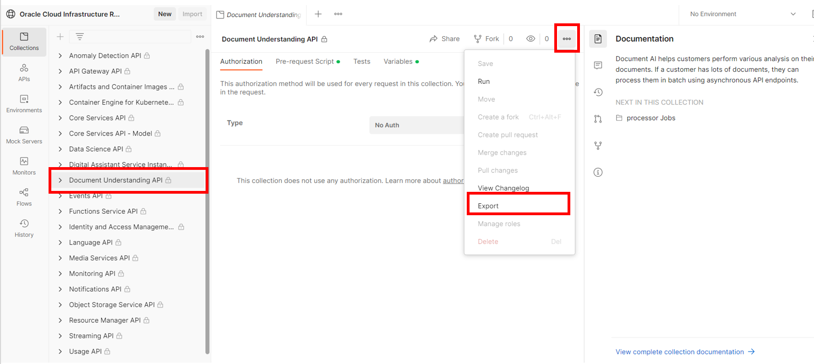

3. Use this [link](https://www.postman.com/oracledevs/workspace/oracle-cloud-infrastructure-rest-apis/environment/29850-eab82db8-e9a1-4200-9f39-de10b4a0f371) to download the **OCI Credentials Environment**. The link opens Postman on the web. Select **Environmments** on the left side of the screen then select **OCI Credentials**. One the right side of the screen find the 3 dots and click it to open a popup menu. On the menu click **Export** to export the credentials file and save it to your local computer.
  

## Task 2: Set up your OCI credentials

1. Import the OCI Credentials file into Postman running on your local machine by using the **Import** button at the top.
  

2. In the *Import* dialog, click the **Upload Files** button and select the json file you exported in the previous step. (**OCI Credentials.postman_environment.json**) 

3. Set OCI Credentials as the active environment by **clicking the check** next to *OCI Credentials*
  

4. Now we will set the variables in the OCI Credentials in your local POSTMAN and you'll obtain the needed values from your OCI tenancy.

  Open the newly imported environment in POSTMAN: OCI Credentials. You'll see it contains multiple variables with empty values. We need to set 6 of those variables.
    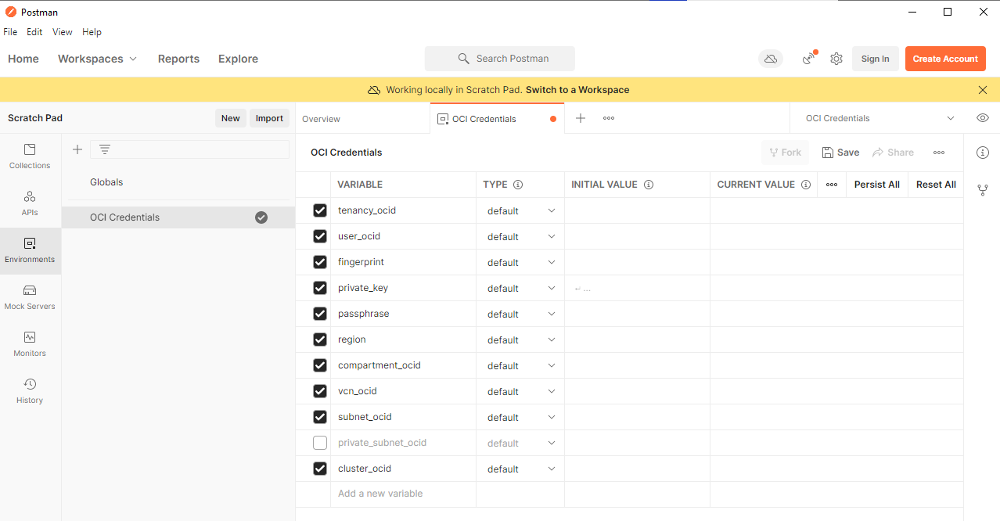

  #### a. tenancy_ocid ####

  1. To get the **tenancy_ocid**, open the OCI Console, click the **Profile** icon in the upper right corner, then select **Tenancy: *name***
    

  2. Copy the **OCID** on this page and add it to your Postman OCI Credentials in the **tenancy_ocid CURRENT VALUE** field.

    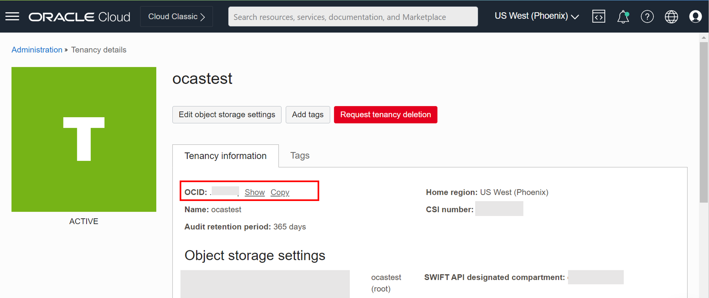


    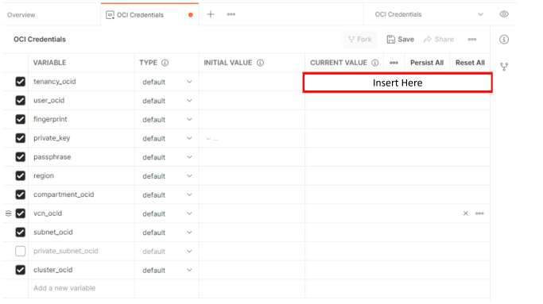

#### b. user_ocid ####
  1. To get the **user_ocid**, go back to the OCI Console, click the **Profile** icon, then select **your user name**

    

  2. The *User Details* page opens. Copy the **OCID** on this page and add it to your Postman OCI Credentials in the **user_ocid CURRENT VALUE** field.

    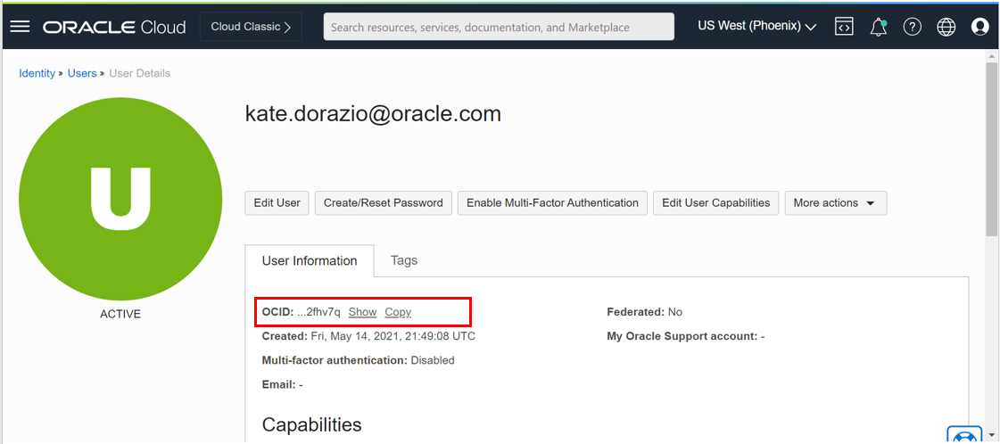


    

#### c. fingerprint & private_key ####

  1. Open the OCI Console, click the **Profile** icon, then select **your user name**.

    

  2. The User Details page opens. Under Resources, on the lower left side of the page, select **API Keys**

    

  3. Click the **Add API Key** button

    

  4. The Add API Key dialog box opens. Select option: **Generate API Key Pair**

    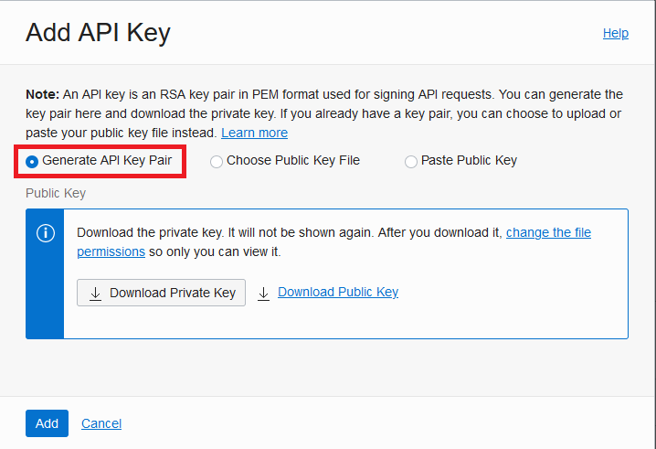

  5. Click the **Download Private Key** button and save the file to you local computer. Remember the location where you saved the private key file (*username-date*.pem).

    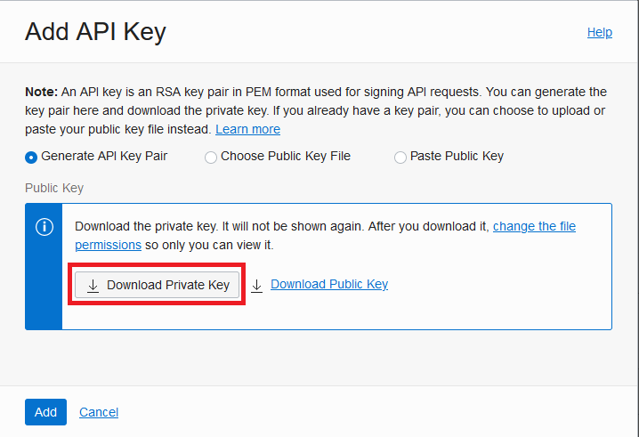

  6. Click the **Add** button in the *Add API Key* dialog. The *Configuration File Preview* dialog opens.

  7. Click **Close** on the *Configuration File Preview* dialog


  8. Copy the **fingerprint** for the API Key that you just created and add it to the **fingerprint CURRENT VALUE** field of the Postman Environment.

    

  

    

  9. On your local computer, navigate to the **private key file (*username-date*.pem)** that you downloaded when getting the fingerprint. Open it in a text editor, copy it's contents, and paste them into the **private_key CURRENT VALUE** field of the Postman Environment.

    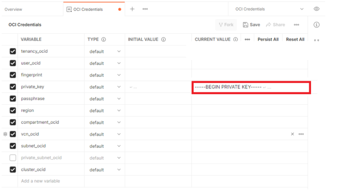

#### d. region ####

1. In the OCI Console, note the **home region** displayed near the upper right corner of the page (e.g. US East (Ashburn)). Find the corresponding **Region Identifier** displayed in the table below (e.g. us-ashburn-1) and copy and paste it into the **region CURRENT VALUE** field of the Postman Environment. Overwrite the default value if your region is different.

  


| Region Name |	Region Identifier |	Region Location |
|-------------|-------------------|-----------------|
|Australia East (Sydney) |	ap-sydney-1 |	Sydney, Australia |
|Australia Southeast (Melbourne) |	ap-melbourne-1 |	Melbourne, Australia |
|Brazil East (Sao Paulo) |	sa-saopaulo-1 |	Sao Paulo, Brazil |
|Brazil Southeast (Vinhedo) |	sa-vinhedo-1 |	Vinhedo, Brazil |
|Canada Southeast (Montreal) |	ca-montreal-1 |	Montreal, Canada |
|Canada Southeast (Toronto) |	ca-toronto-1 |	Toronto, Canada |
|Chile (Santiago) |	sa-santiago-1 |	Santiago, Chile |
|France South (Marseille) |	eu-marseille-1 |	Marseille, France |
|Germany Central (Frankfurt) |	eu-frankfurt-1 |	Frankfurt, Germany |
|India South (Hyderabad) |	ap-hyderabad-1 |	Hyderabad, India |
|India West (Mumbai) |	ap-mumbai-1 |	Mumbai, India |
|Israel Central (Jerusalem) |	il-jerusalem-1 |	Jerusalem, Israel |
|Italy Northwest (Milan) |	eu-milan-1 |	Milan, Italy |
|Japan Central (Osaka) |	ap-osaka-1 |	Osaka, Japan |
|Japan East (Tokyo) |	ap-tokyo-1 |	Tokyo, Japan |
|Netherlands Northwest (Amsterdam) |	eu-amsterdam-1 |	Amsterdam, Netherlands |
|Saudi Arabia West (Jeddah) |	me-jeddah-1 |	Jeddah, Saudi Arabia |
|Singapore (Singapore) |	ap-singapore-1 |	Singapore,Singapore |
|South Africa Central (Johannesburg) |	af-johannesburg-1 |	Johannesburg, South Africa |
|South Korea Central (Seoul) |	ap-seoul-1 |	Seoul, South Korea |
|South Korea North (Chuncheon) |	ap-chuncheon-1 |	Chuncheon, South Korea |
|Sweden Central (Stockholm) |	eu-stockholm-1 |	Stockholm, Sweden |
|Switzerland North (Zurich) |	eu-zurich-1 |	Zurich, Switzerland |
|UAE Central (Abu Dhabi) |	me-abudhabi-1 |	Abu Dhabi, UAE |
|UAE East (Dubai) |	me-dubai-1 |	Dubai, UAE |
|UK South (London) |	uk-london-1 |	London, United Kingdom |
|UK West (Newport) |	uk-cardiff-1 |	Newport, United Kingdom |
|US East (Ashburn) |	us-ashburn-1 |	Ashburn, VA |
|US West (Phoenix) |	us-phoenix-1 |	Phoenix, AZ |
|US West (San Jose) |	us-sanjose-1 |	San Jose, CA |

  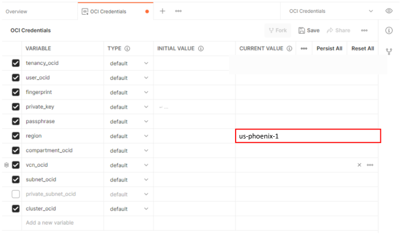

The information in the table is found here: https://docs.oracle.com/en-us/iaas/Content/General/Concepts/regions.htm

#### e. compartment_ocid ####

1. Go to the OCI Console and use the hamburger menu to select **Identity & Security**, then, under *Identity*, select **Compartments**.
  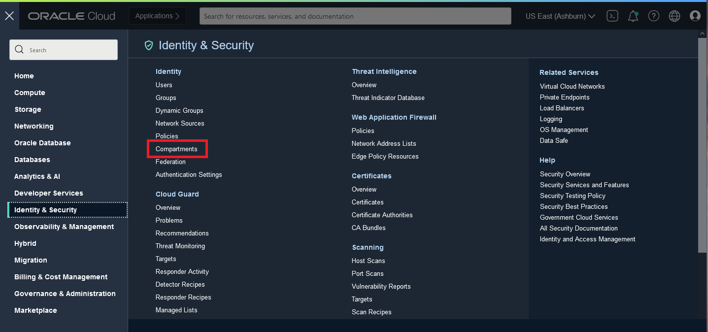

2. The *Compartments* page is displayed and lists all of the compartments. If you are using a new trial tenancy, you will have a root compartment and *ManagedCompartmentForPaaS*. **Click the name of the root compartment** you configured in Lab 2 to access the OCI Document Understanding service.

3. On the *Compartment details* page, click **Copy** next to the compartment OCID.
  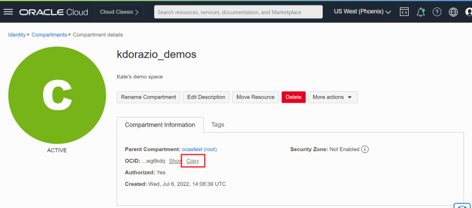

4. Paste the OCID into the **compartment_ocid CURRENT VALUE** field of the Postman Environment.

  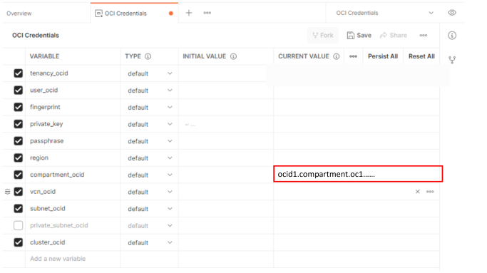

#### f. save ####

1. In POSTMAN, click the **Persist All** button to save the Current Value to the Initial Value.

  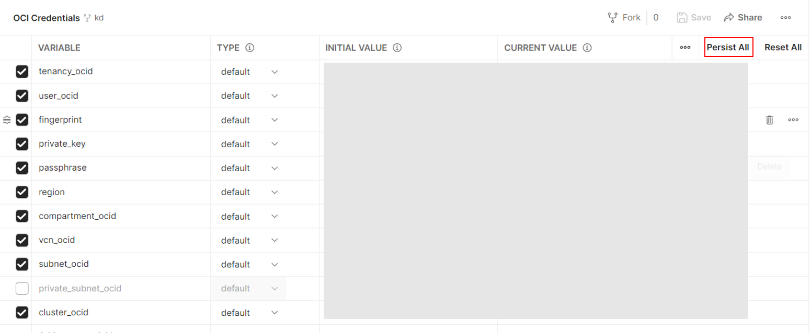

2. In POSTMAN, click the **Save** button to save all of the OCI Credentials that you just entered.

  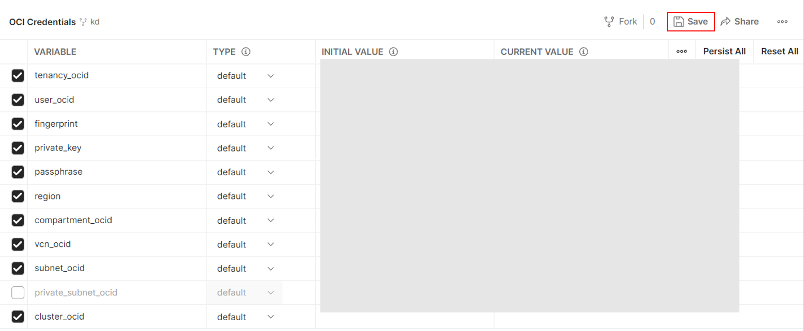

## Task 3: Import the Document Understanding API collection

1. Import the Document Understanding API Collection file (**DocumentUnderstanding API.postman_collection.json**) into Postman running on your local machine by selecting **Collections** on the left side of the  screen then clicking the **Import** button at the top.

  

2. In the *Import* dialog, click the **Upload Files** button and select the json file you exported in Task 1 (**DocumentUnderstanding API.postman_collection.json**).

## Task 4: Invoke the Processor Job REST API

In this task you'll call the Processor Job REST API.

1. In POSTMAN, select **Collections**, then expand *Document Understanding API* then *actions* then click **processor Jobs**. Then select the **Body** tab under *POST*.

  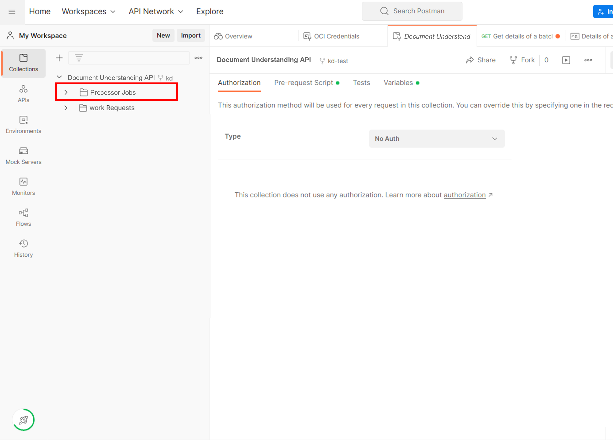

2. Replace the contents of the **Body** with the following:

  ```http
  <copy>
  {
    "processorConfig": {
      "processorType": "GENERAL",
      "features": [
        {
          "featureType": "TEXT_EXTRACTION",
          "generateSearchablePdf": true
        }
      ]
    },
    "inputLocation": {
      "sourceType": "OBJECT_STORAGE_LOCATIONS",
      "objectLocations": [
        {
          "source": "OBJECT_STORAGE",
          "namespaceName": ##todo
          "bucketName": ##todo
          "objectName": ##todo
        }
      ]
    },
    "compartmentId": "{{compartmentId}}"
    "outputLocation": {
      "namespaceName": ##todo
      "bucketName": ##todo
      "prefix": ##todo
    }
  }
  </copy>
  ```

In the next steps, you will insert your location details for the document you want to analyze
1. To get the namespace name, open the OCI Console, click the **Profile** icon and select **Tenancy: *name***
  

2. Copy the **Object Storage Namespace** value and paste it into the Body in POSTMAN as the value for *namespaceName*
  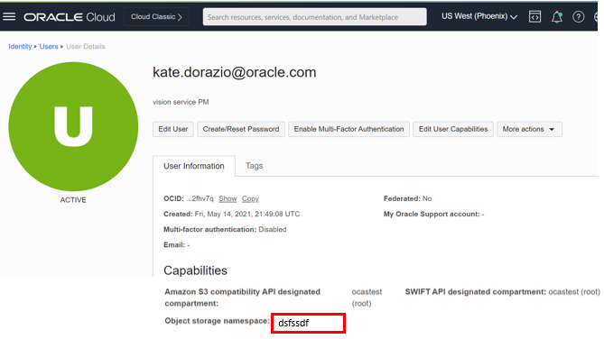

3. *bucketName* should be the name of the bucket where you uploaded the sample image for this lab.

4. *objectName* should be **"invoice-sample.jpg"** unless you have renamed it in your bucket.


Now, you will insert your location details for where you want your results to be stored. For this demo, we are testing out Text Extraction, which will return a JSON object to the object storage location of your choosing. Below is what you need to define:

1. *Object Storage Namespace*: use the namespace from the previous step

2. *bucketName*: should be the name of the bucket where you want your results stored

3. *prefix*: use "results"


In POSTMAN, click the **Send** button. The response should return in a few seconds with a job ID.


## Task 5: Get Job Details

In this task, you'll call the Document AI synchronous REST API using POSTMAN.

1. In the Document Understanding collection, under Processor Jobs click **Get Details of a processor Job**.

2. Add the JobId response from the previous step to the end of the URL and click Send
  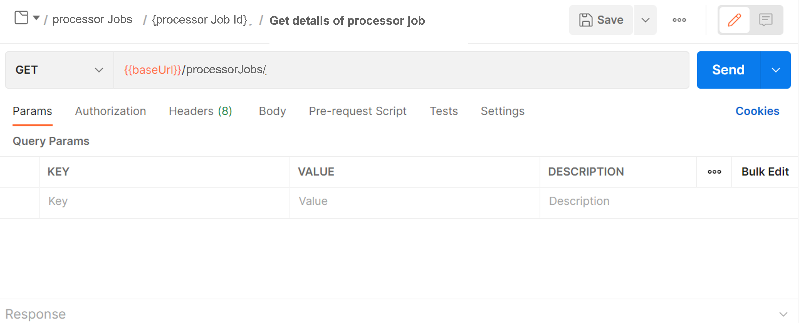

1. Review the response and notice the structure of the data including lifecycleDetails and percentComplete

  ```http
  <copy>
  {
    "compartmentId": "eu sunt id est",
    "features": [
      {
        "featureType": "TEXT_EXTRACTION"
      }
    ],
    "id": "pariat",
    "lifecycleState": "IN_PROGRESS",
    "outputLocation": {
      "bucketName": "sed Duis",
      "namespaceName": "in pariatur mollit ut",
      "prefix": "Duis laborum deserunt"
    },
    "timeAccepted": "1967-10-23T03:20:17.411Z",
    "displayName": "amet est qui",
    "documentType": "OTHERS",
    "inputLocation": {
      "sourceType": "OBJECT_LIST_INLINE_INPUT_LOCATION"
    },
    "isZipOutputEnabled": false,
    "language": "ENG",
    "lifecycleDetails": "SUCCEEDED",
    "percentComplete": 71.68026659053332,
    "timeFinished": "1944-01-15T08:55:51.710Z",
    "timeStarted": "1987-12-05T05:34:39.081Z"
  }
  </copy>
  ```
1. Now, in your object storage output bucket look under the "results" folder. You'll find a JSON file that includes all the text extracted from the original document
  

You have completed this lab!

## Acknowledgements
* **Authors**
    * Kate D'Orazio - Product Manager


* **Last Updated By/Date**
    * Kate D'Orazio, Feb 2023
